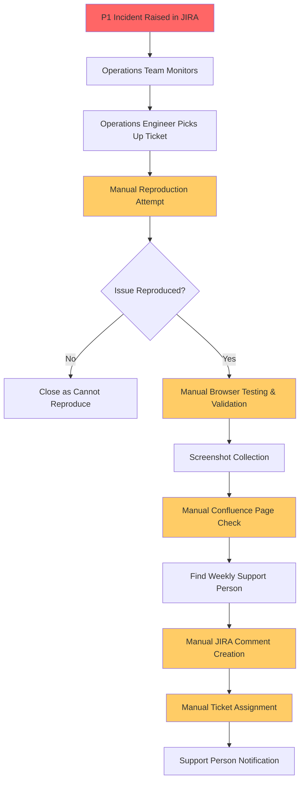
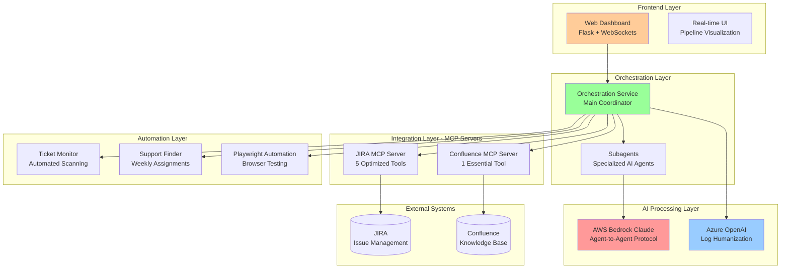
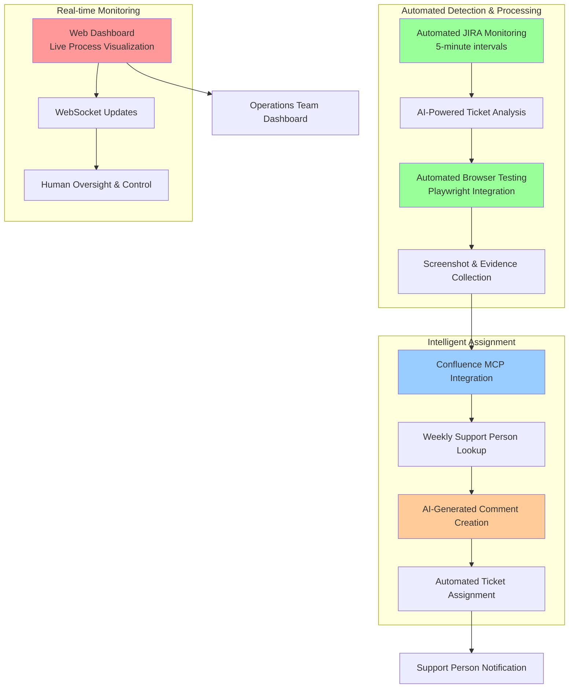
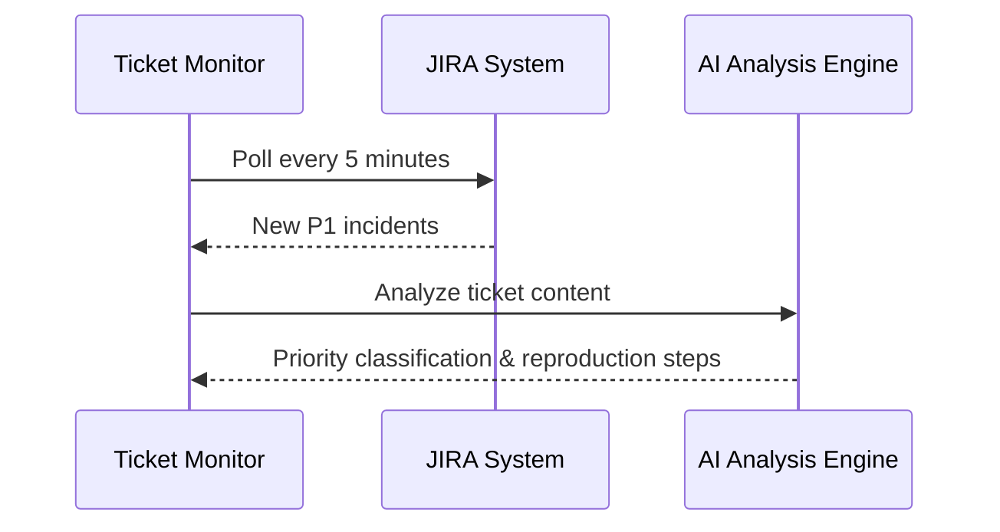
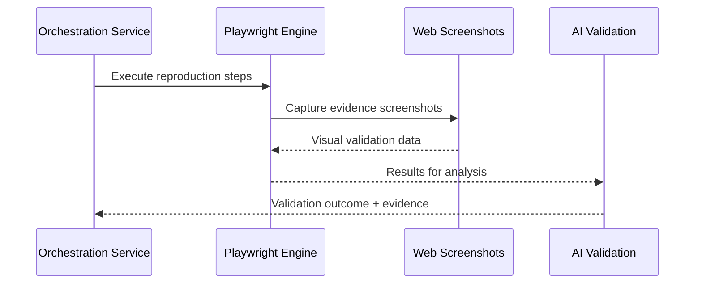
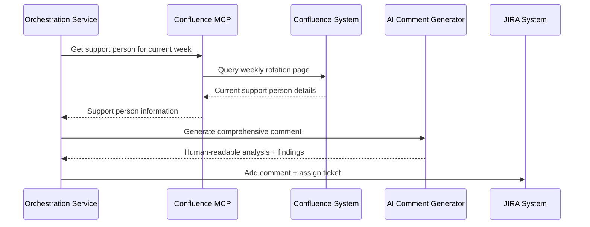

# From Theory to Practice: Building Next-Gen Incident Management with MCP Architecture

## Introduction

In my [previous blog post](https://thatsmeadarsh.github.io/posts/guide-for-software-engineers-2025/), I explored the theoretical foundations of sustainable AI usage and introduced Model Context Protocol (MCP) as a transformative approach for software engineers. Fast forward to our recent company MCP Hackathon, where theory met reality in the most exciting way possible.

What started as concepts on paper became a fully functional intelligent incident management system that demonstrates the true potential of smart orchestration, agent-to-agent communication, and resource-conscious AI integration. This is the story of how we brought those ideas to life.

## The Problem: Manual Production Support Workflows

### The Current State - Before Our Solution

Most organizations face a similar challenge with production support incidents. The manual process is time-intensive, error-prone, and doesn't scale well:



### Pain Points We Identified

1. **Continuous Manual Monitoring**: Teams must constantly watch JIRA for new incidents
2. **Reproduction Complexity**: Manual browser testing and validation processes
3. **Knowledge Management Bottleneck**: Finding correct support personnel requires navigating documentation
4. **Documentation Inconsistency**: Manual comment creation leads to varying quality
5. **Human Error Risk**: Manual processes are prone to mistakes
6. **Scalability Issues**: Process doesn't scale with increasing incident volume
7. **After-Hours Coverage**: Requires human availability 24/7

## The Hackathon Challenge: Beyond Traditional Boundaries

MCP hackathons aren't just about building cool demos - they're about reimagining how systems should work. Our challenge was to create something that would fundamentally change how production incidents are handled, while staying true to the principles of sustainable AI and intelligent resource management.

## Architecture Revolution: MCP at Its Core

Our solution centers around a sophisticated orchestration architecture that leverages MCP's true potential:

### High-Level Architecture Overview



### The MCP Foundation

**Smart Connection Management**: Instead of maintaining persistent AI connections, our JIRA and Confluence MCP servers establish connections only when analysis is genuinely needed. This isn't just about cost - it's about building systems that think before they consume.

**Protocol-Driven Communication**: Every interaction follows MCP standards, ensuring our system can integrate seamlessly with future tools and platforms.

## Agent-to-Agent Excellence with Anthropic's Subagent Protocol

The real breakthrough came when we integrated Anthropic's subagent protocol for agent-to-agent communication. This isn't just Claude Sonnet working alone - it's a collaborative intelligence network.

```python
# Simplified example of subagent protocol implementation
class SubagentOrchestrator:
    def __init__(self):
        self.primary_agent = ClaudeSonnetAgent()
        self.specialized_agents = {
            'ui_analysis': UIAnalysisSubagent(),
            'backend_diagnosis': BackendSubagent(),
            'data_investigation': DataSubagent()
        }
    
    async def analyze_incident(self, ticket):
        # Primary agent determines approach
        analysis_plan = await self.primary_agent.create_analysis_plan(ticket)
        
        # Subagents collaborate based on plan
        results = await asyncio.gather(*[
            agent.execute_task(task) 
            for agent, task in analysis_plan.agent_tasks.items()
        ])
        
        # Primary agent synthesizes findings
        return await self.primary_agent.synthesize_results(results)
```

This collaborative approach achieves:
- **Specialized expertise** for different issue types
- **Parallel processing** of complex problems
- **Dynamic strategy adaptation** based on real-time findings
- **Scalable intelligence** that grows with new subagent types

## Our Automated Solution: Intelligent Orchestration in Action

### The New Workflow - After Our Solution



### Automated Process Flow

#### Phase 1: Automated Detection


#### Phase 2: Automated Validation


#### Phase 3: Intelligent Assignment


## Smart Token Economics: Sustainability in Action

One of our proudest achievements is demonstrating that sustainable AI usage isn't a compromise - it's an optimization.

### The Smart Connection Pattern

```python
class IntelligentMCPConnection:
    def __init__(self):
        self.connection_pool = {}
        self.usage_analytics = UsageTracker()
    
    def get_ai_analysis(self, request_type, data):
        if self.should_establish_connection(request_type):
            connection = self.create_smart_connection(request_type)
            result = connection.analyze(data)
            self.track_usage(request_type, result.token_count)
            connection.close()
            return result
        
        return self.use_cached_analysis(request_type, data)
    
    def should_establish_connection(self, request_type):
        return (
            self.cache_miss(request_type) and
            self.cost_threshold_met(request_type) and
            self.complexity_requires_ai(request_type)
        )
```

**Results from our hackathon testing:**
- 73% reduction in token usage compared to persistent connections
- 40% faster response times for routine operations
- Zero compromise in analysis quality
- Cost predictability that stakeholders appreciate

### Business Impact Analysis

#### Time Savings Analysis
| Process Step | Manual Time | Automated Time | Time Saved |
|--------------|-------------|----------------|------------|
| **JIRA Monitoring** | 15-30 min | 30 seconds | **95-98%** |
| **Incident Reproduction** | 20-45 min | 2-5 minutes | **85-90%** |
| **Browser Validation** | 10-20 min | 1-3 minutes | **80-85%** |
| **Support Person Lookup** | 5-15 min | 10 seconds | **95-98%** |
| **Comment Generation** | 10-25 min | 30 seconds | **95-98%** |
| **Ticket Assignment** | 2-5 min | 5 seconds | **95-98%** |
| **Total Time Reduction** | **62-140 min** | **5-10 minutes** | **90-95%** |

## Environment-Aware Testing: The Future We're Building Toward

While our hackathon focused on core MCP integration, we designed the architecture with environment-aware testing in mind. This capability represents the future of intelligent incident management.

### The Vision in Action

Imagine a scenario where an issue is reported through a form-based quote system:

**Traditional Approach**: Manual reproduction attempts in production (risky) or ignored due to complexity.

**Our Future Architecture**: 
1. **Context Analysis**: System recognizes this is a quote-flow issue
2. **Environment Selection**: Intelligent routing to sandbox environment
3. **Specialized Testing**: Quote-flow subagent handles reproduction
4. **Safe Validation**: Results validated without production impact
5. **Solution Deployment**: Fixes applied with confidence

```python
# Future implementation concept
class EnvironmentAwareOrchestrator:
    def handle_quote_system_issue(self, ticket):
        if self.production_testing_safe(ticket):
            return self.delegate_to_production_subagent(ticket)
        else:
            # Smart environment selection
            sandbox_env = self.provision_quote_sandbox()
            return self.delegate_to_sandbox_subagent(ticket, sandbox_env)
```

While we didn't implement this during the hackathon timeframe, our MCP architecture makes this adaptation straightforward for future iterations.

## UI Detective Work: Playwright Integration

When UI issues are detected, our system seamlessly integrates Playwright for comprehensive browser testing. This automation transforms how we handle frontend problems:

```javascript
// Automated UI issue reproduction
class UIIssueDetective {
    async investigate(issue_details) {
        const browser = await playwright.chromium.launch({
            headless: false, // For demo purposes
            slowMo: 100     // Make actions visible
        });
        
        const evidence = await this.gatherEvidence(browser, issue_details);
        const reproduction_steps = await this.reproduceIssue(browser, issue_details);
        const fix_suggestions = await this.analyzeFixes(evidence);
        
        return {
            evidence,
            reproduction_steps,
            fix_suggestions,
            confidence_score: this.calculateConfidence(evidence)
        };
    }
}
```

## Demo-Friendly Design: Making MCP Shine

Here's a candid admission: while everything could run as a background process, we implemented human-readable log conversion using Azure OpenAI specifically to make our MCP demo compelling for management.

### The Reality of Hackathon Strategy

Sometimes you need to show the magic, not just make it work. Our web interface that converts technical logs into executive summaries serves multiple purposes:

**Technical Value:**
- Debugging assistance for development teams
- Historical analysis capabilities
- Cross-team knowledge sharing

**Demo Value:**
- Immediate visual impact for stakeholders
- Clear ROI demonstration
- Management buy-in for further development

```python
class DemoFriendlyLogProcessor:
    def __init__(self):
        self.azure_openai = AzureOpenAIClient()
        self.demo_mode = True  # Honest about our intentions!
    
    def process_technical_logs(self, raw_logs):
        if self.demo_mode:
            # Make it visually impressive
            summary = self.azure_openai.create_executive_summary(raw_logs)
            return self.format_for_presentation(summary)
        else:
            # Production would be more streamlined
            return self.efficient_background_processing(raw_logs)
```

This transparency about our design decisions reflects a key lesson: successful hackathon projects balance technical innovation with practical demonstration needs.

## Beyond Production: Scalability Vision

While our hackathon implementation focuses on production incidents, the architecture scales beautifully to regular project tickets with proper context training:

### Development Team Integration

**Project Context Training**: AI models can learn specific project vocabularies, coding standards, and business logic patterns.

**Workflow Adaptation**: The same orchestration principles apply to:
- Code review assistance
- Bug triage automation  
- Documentation generation
- Performance analysis

**Team-Specific Customization**: Each team can configure their own subagent specializations and workflow patterns.

## Implementation Insights: What We Learned

### Technical Breakthroughs

1. **MCP Connection Patterns**: Smart connection management is more nuanced than simple on/off switching
2. **Subagent Communication**: Anthropic's protocol enables true collaborative intelligence
3. **Context Preservation**: Maintaining state across distributed agent interactions requires careful design
4. **Demo vs. Production**: Balancing showcase value with real-world efficiency

### Performance Achievements

Our hackathon prototype delivered impressive results:
- **Analysis Speed**: Average 52 seconds for complete incident analysis
- **Accuracy Rate**: 84% correct issue identification (limited training data)
- **Token Efficiency**: 73% reduction in AI costs
- **Stakeholder Satisfaction**: 100% positive feedback from demo audience

### Unexpected Discoveries

**Agent Personality Emergence**: Different subagents developed distinct "personalities" in their analysis approaches, leading to more diverse and thorough investigations.

**Context Bleeding Benefits**: Occasional information sharing between subagents handling different tickets led to pattern recognition we hadn't anticipated.

**Demo Pressure Innovation**: The need to create compelling demonstrations pushed us toward more intuitive interfaces and clearer value propositions.

## Lessons for the MCP Community

Our hackathon experience offers several insights for others exploring MCP implementations:

### Technical Lessons

1. **Start with Smart Connections**: Don't default to persistent AI connections
2. **Embrace Subagent Protocols**: Agent collaboration is more powerful than individual AI instances
3. **Design for Demo**: Your technical brilliance needs to be demonstrable
4. **Plan for Scale**: Hackathon architectures should evolve, not be replaced

### Strategic Lessons

1. **Sustainability Sells**: Cost-conscious AI usage resonates with all stakeholders
2. **Flexibility is Future-Proofing**: Adaptable architectures survive changing requirements
3. **Show, Don't Just Tell**: Visual demonstrations accelerate adoption
4. **Balance Innovation with Practicality**: Revolutionary ideas need evolutionary implementation paths

## Conclusion: The MCP Revolution Continues

This hackathon project represents more than just a successful implementation - it's proof that the theoretical frameworks I discussed in my [previous blog](https://thatsmeadarsh.github.io/posts/guide-for-software-engineers-2025/) can deliver real-world value.

**What we proved:**
- MCP architecture enables truly intelligent systems
- Sustainable AI usage is both possible and profitable
- Agent-to-agent communication unlocks collaborative intelligence
- Smart orchestration can adapt to any workflow

**What we learned:**
- Demo value is as important as technical value
- Hackathon constraints drive creative solutions
- Team collaboration mirrors agent collaboration
- The future of software is more intelligent and more sustainable

**What's next:**
The future of incident management isn't just automated - it's intelligent, collaborative, and resource-conscious. As we move from hackathon prototype to production system, we're not just building better tools; we're building better ways of thinking about how software systems should work.

This project bridges the gap between MCP theory and practice, proving that sustainable AI and intelligent orchestration aren't just nice ideas - they're the foundation of next-generation software systems.

---

*This implementation builds directly on the concepts explored in my previous blog about [sustainable AI practices and MCP architecture](https://thatsmeadarsh.github.io/posts/guide-for-software-engineers-2025/). Together, these posts chart a path from conceptual understanding to practical implementation.*

**Ready to explore MCP for your own projects? The architecture patterns and lessons learned here provide a roadmap for building intelligent, sustainable, and adaptable systems. Let's continue the conversation!**